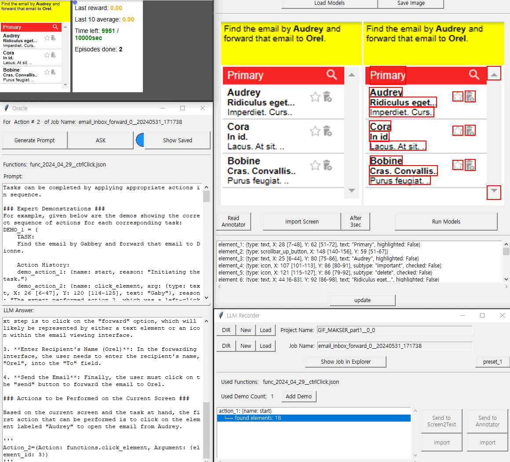

## How to Use
### Quick Start
```python
python3 main_controller.py
```
* Click 'RUN' button on the 'Main Controller' window.

***
<p align="center">
CAAP Agent Demonstration about sampled tasks
<p align="center">



***
### Comprehensive Guide
***

* #### Let's go through the steps of how it works when the "**Run**" button on the **Main Controller** is pressed.
    ```
    1. Run main_controller.py 
    2. Click '**LLM Agent Recorder**' button on the **Main Controller**.
    3. Click the first '**New**' button at the top of the **LLM Agent Recorder**.
    4. Click the second '**New**' button at the top of the **LLM Agent Recorder**.
    5. If there is/are a demo(s) performed by a person in the same environment with a different seed, add it/them.
       (optional) Click the '**Add Demo**' button on the **LLM Agent Recorder**.
    6. Click the '**Send to Virsual Observer**' button on the **LLM Agent Recorder**.
    7. Click the '**refresh list**' on the **Visual Observer**.
    8. Click the '**Load Models**' on the **Visual Observer**.
    9. Click the '**Run Models**' on the **Visual Observer**.
    10. Click the '**Import**' button below 'Send to VisualObserver' on the **LLM Agent Recorder**.
    11. Click the '**Send to CAAP Prompter**' button on the **LLM Agent Recorder**.
    12. Click the '**ASK**' button on the **CAAP Prompter**.
    13. Click the '**ACT**' button on the **LLM Agent Recorder**.<br>
    (Exceptionally, for the 'choose-list' task, press the 'Act from the Top' button on the **LLM Agent Recorder**.)
    14. Repeat steps 6 to 13 until successful.
    ```

* #### If the experiment has been terminated normally, a project folder will be created in the path 'data > llm_agent_record', and you can check the results through the file {project_name}_result.txt.